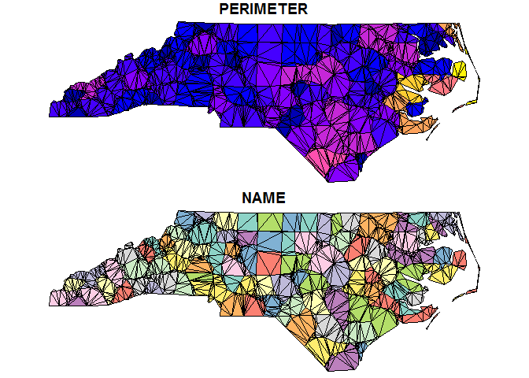

<!-- README.md is generated from README.Rmd. Please edit that file -->
[](https://travis-ci.org/r-gris/sfdct) [](https://ci.appveyor.com/project/r-gris/sfdct) [](https://cran.r-project.org/package=sfdct)

sfdct
=====

The goal of sfdct is to provide constrained triangulations of simple features.

Example
-------

This is a basic example which shows you how to decompose a MULTIPOLYGON `sf` data frame object into a GEOMETRYCOLLECTION `sf` data frame object made of triangles:

``` r
library(sf)
library(sfdct)
nc <- st_read(system.file("shape/nc.shp", package="sf"))
#> Reading layer `nc' from data source `C:\Users\mdsumner\Documents\R\win-library\3.3\sf\shape\nc.shp' using driver `ESRI Shapefile'
#> converted into: MULTIPOLYGON
#> Simple feature collection with 100 features and 14 fields
#> geometry type:  MULTIPOLYGON
#> dimension:      XY
#> bbox:           xmin: -84.32385 ymin: 33.88199 xmax: -75.45698 ymax: 36.58965
#> epsg (SRID):    4267
#> proj4string:    +proj=longlat +datum=NAD27 +no_defs
(nc_triangles <- ct_triangulate(nc[1:5, c("NAME")]))
#> Simple feature collection with 5 features and 1 field
#> geometry type:  GEOMETRYCOLLECTION
#> dimension:      XY
#> bbox:           xmin: -81.74107 ymin: 36.07282 xmax: -75.77316 ymax: 36.58965
#> epsg (SRID):    4267
#> proj4string:    +proj=longlat +datum=NAD27 +no_defs
#>          NAME                       geometry
#> 1        Ashe GEOMETRYCOLLECTION(POLYGON(...
#> 2   Alleghany GEOMETRYCOLLECTION(POLYGON(...
#> 3       Surry GEOMETRYCOLLECTION(POLYGON(...
#> 4   Currituck GEOMETRYCOLLECTION(POLYGON(...
#> 5 Northampton GEOMETRYCOLLECTION(POLYGON(...

(asub <- st_geometry(nc_triangles)[[4]] )
#> GEOMETRYCOLLECTION(POLYGON((-76.091064453125 36.5035667419434, -76.1581497192383 36.4126892089844, -76.095085144043 36.3489151000977, -76.091064453125 36.5035667419434)), POLYGON((-76.1581497192383 36.4126892089844, -76.1609268188477 36.3918991088867, -76.095085144043 36.3489151000977, -76.1581497192383 36.4126892089844)), POLYGON((-76.095085144043 36.3489151000977, -76.0439529418945 36.3535919189453, -76.0016098022461 36.4189147949219, -76.095085144043 36.3489151000977)), POLYGON((-76.0016098022461 36.4189147949219, -76.0439529418945 36.3535919189453, -76.0173492431641 36.3377304077148, -76.0016098022461 36.4189147949219)), POLYGON((-75.9512557983398 36.3654708862305, -76.0016098022461 36.4189147949219, -76.0173492431641 36.3377304077148, -75.9512557983398 36.3654708862305)), POLYGON((-76.0173492431641 36.3377304077148, -76.0439529418945 36.3535919189453, -76.0328750610352 36.3359756469727, -76.0173492431641 36.3377304077148)), POLYGON((-76.091064453125 36.5035667419434, -76.095085144043 36.3489151000977, -76.0016098022461 36.4189147949219, -76.091064453125 36.5035667419434)), POLYGON((-76.1682891845703 36.4270858764648, -76.091064453125 36.5035667419434, -76.1273956298828 36.5571632385254, -76.1682891845703 36.4270858764648)), POLYGON((-76.1682891845703 36.4270858764648, -76.1581497192383 36.4126892089844, -76.091064453125 36.5035667419434, -76.1682891845703 36.4270858764648)), POLYGON((-76.1273956298828 36.5571632385254, -76.3302536010742 36.5560569763184, -76.1682891845703 36.4270858764648, -76.1273956298828 36.5571632385254)))

plot(asub, col = "aliceblue")
```



See the vignettes for more examples.

Please note that this project is released with a [Contributor Code of Conduct](CONDUCT.md). By participating in this project you agree to abide by its terms.
