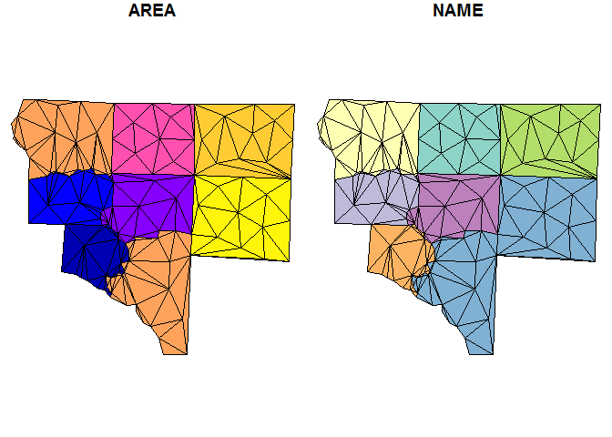
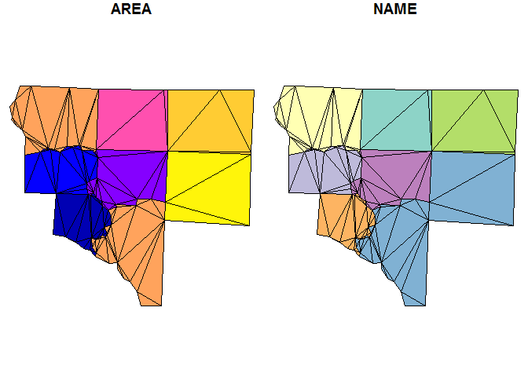
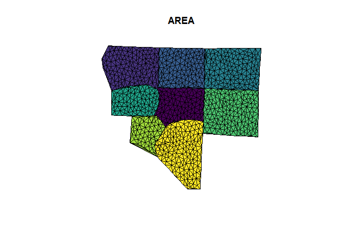
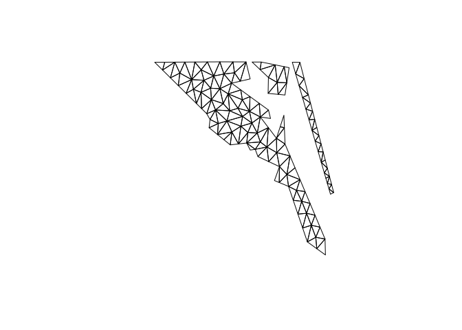

<!-- README.md is generated from README.Rmd. Please edit that file -->
[](https://travis-ci.org/r-gris/sfct) [](https://ci.appveyor.com/project/r-gris/sfct) [](https://cran.r-project.org/package=sfct)

sfct
====

The goal of sfct is to provide constrained triangulations of simple features.

Example
-------

This is a basic example which shows you how to decompose a MULTIPOLYGON `sf` data frame object into a GEOMETRYCOLLECTION `sf` data frame object made of triangles:

``` r
library(sf)
#> Linking to GEOS 3.5.0, GDAL 2.1.1, proj.4 4.9.3
library(sfct)
nc <- st_read(system.file("shape/nc.shp", package="sf"))
#> Reading layer `nc' from data source `C:\Users\mdsumner\Documents\R\win-library\3.3\sf\shape\nc.shp' using driver `ESRI Shapefile'
#> converted into: MULTIPOLYGON
#> Simple feature collection with 100 features and 14 fields
#> geometry type:  MULTIPOLYGON
#> dimension:      XY
#> bbox:           xmin: -84.32385 ymin: 33.88199 xmax: -75.45698 ymax: 36.58965
#> epsg (SRID):    4267
#> proj4string:    +proj=longlat +datum=NAD27 +no_defs
nc_triangles <- ct_triangulate(nc)
plot(nc_triangles[, c("PERIMETER", "NAME")])
```


We can use the underlying `RTriangle::triangulate` arguments to hone the triangles we get.

``` r
i_feature <- 25
nc1 <- nc[c(i_feature, unlist(st_touches(nc[i_feature, ], nc))), ]
#> although coordinates are longitude/latitude, it is assumed that they are planar
plot(nc1[, c("AREA", "NAME")])
```


``` r

## subvert st_area because we really don't want m^2
st_crs(nc1) <- NA
areas <- st_area(nc1)
st_crs(nc1) <- st_crs(nc)
nc1_triangles <- ct_triangulate(nc1, a = min(areas)/5)
plot(nc1_triangles[, c("AREA", "NAME")])
```



``` r

nc2_triangles <- ct_triangulate(nc1, a = min(st_area(nc1))/25)
plot(nc2_triangles[, c("AREA", "NAME")])
```



Get a grouped triangulated set from a MULTIPOINT. Note how these aren't constrained by the edges of the input polygons (because we threw those away!) but these are controlled to have a smaller maximum area.

Area is calculated in the native coordinates, assuming "planar coordinates", with no respect to the real world.

``` r
mtriangs <- ct_triangulate(st_cast(nc1, "MULTIPOINT"), a = 0.001)
plot(mtriangs[, 1], col = viridis::viridis(nrow(mtriangs)))
```



ggplot2 for simple features
---------------------------

Coming soon.

``` r
library(ggplot2)
## no GEOMETRYCOLLECTION grob yet
##ggplot(nc_triangles) + aes(geometry = geometry, col = NAME) + geom_sf()
gg <- ggplot(st_cast(nc_triangles)) + aes(geometry = geom, fill = NAME) 
#> Warning in st_cast.sf(nc_triangles): repeating attributes for all sub-geometries for which
#> they may not be valid
gg + geom_sf(col = "darkgrey") + guides(fill = FALSE)
```



Please note that this project is released with a [Contributor Code of Conduct](CONDUCT.md). By participating in this project you agree to abide by its terms.
